<div align="center">


# FlowMeter

### Industrial Process Visualization & Analytics Platform

<br>

[](https://github.com/sommaa/flowmeter/releases)
[](https://python.org)
[](https://react.dev)
[](https://typescriptlang.org)
[](https://fastapi.tiangolo.com)
[](https://vite.dev)
[](https://github.com/sommaa/flowmeter/releases)
[](LICENSE)

<br>

**Desktop-first analytics for engineers.** Import, clean, visualize, and analyze industrial process data — locally, with zero cloud dependencies.

<br>

[What is FlowMeter?](#what-is-flowmeter) &nbsp;&bull;&nbsp;
[Quick Start](#quick-start) &nbsp;&bull;&nbsp;
[Features](#features) &nbsp;&bull;&nbsp;
[User Guide](#user-guide) &nbsp;&bull;&nbsp;
[FAQ](#faq) &nbsp;&bull;&nbsp;
[Configuration](#configuration-reference) &nbsp;&bull;&nbsp;
[Technical Reference](#technical-reference) &nbsp;&bull;&nbsp;
[Contributing](#contributing)

<br>

</div>

---

## 📸 Screenshots

<br>

<div align="center">

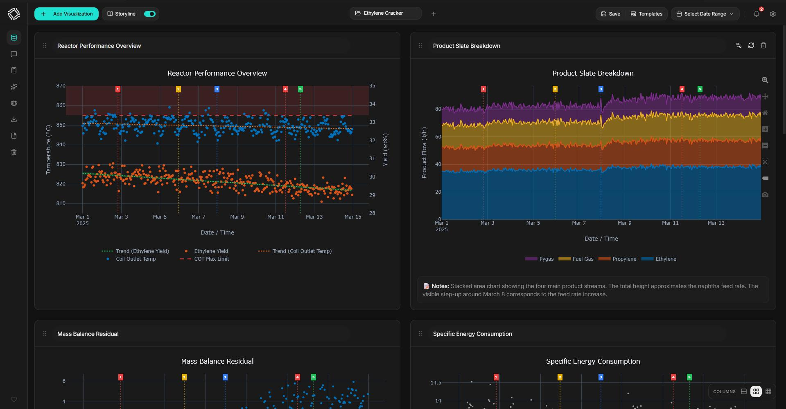
<br><sub><em>Main dashboard with multiple visualization cards, dual Y-axis chart, and sidebar controls</em></sub>

</div>

<br>

<table align="center">
<tr>
<td width="50%">
<div align="center">

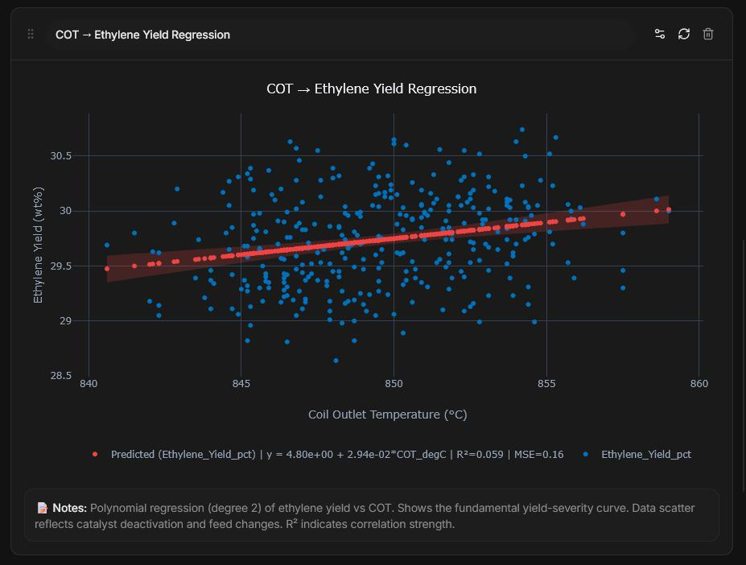
<br><sub><em>Model generation from data.</em></sub>

</div>
</td>
<td width="50%">
<div align="center">

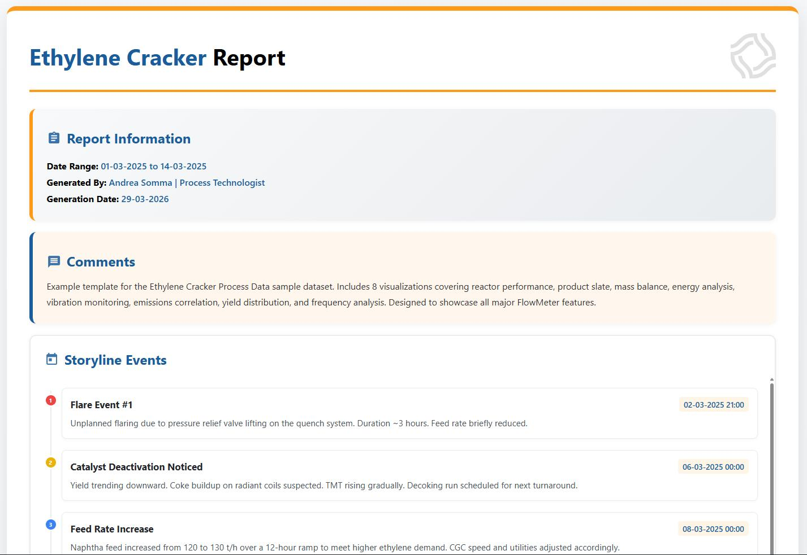
<br><sub><em>Self-contained HTML report generation</em></sub>

</div>
</td>
</tr>
<tr>
<td width="50%">
<div align="center">

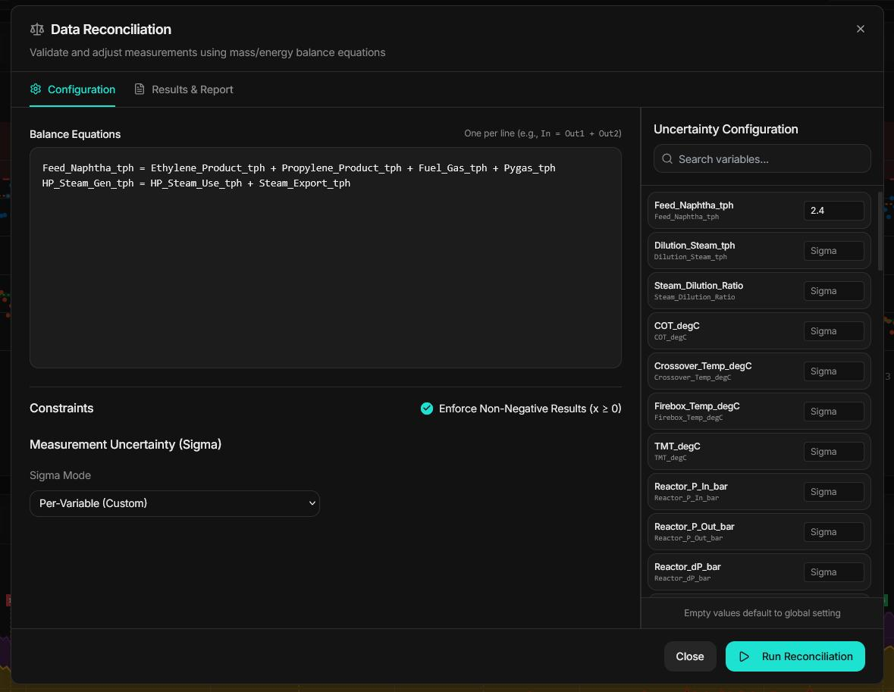
<br><sub><em>Data reconciliation with constraint equations</em></sub>

</div>
</td>
<td width="50%">
<div align="center">

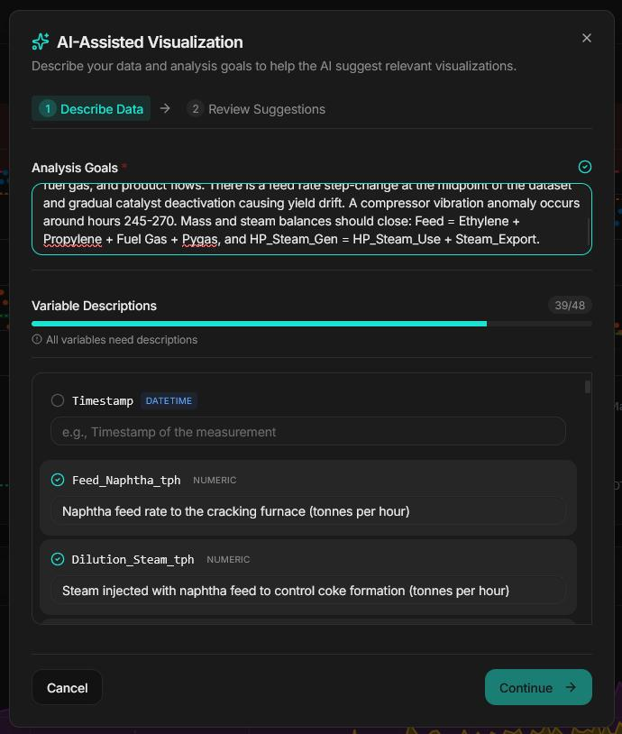
<br><sub><em>AI-powered visualization suggestions panel</em></sub>

</div>
</td>
</tr>
</table>

---

## What is FlowMeter?

FlowMeter is a **local desktop application** for engineers and analysts who work with time-series data from industrial processes. It pairs a FastAPI Python backend with a React frontend into a single, cohesive tool — one that runs entirely on your machine, processes your data locally, and never sends anything to the cloud.

Unlike general-purpose analytics tools, FlowMeter is purpose-built for the problems that come up daily in process engineering: **sensor data that needs cleaning**, **mass balances that need to close**, **regression models for correlating process variables**, and **professional reports for management who don't have Python installed**.

**Who is it for?**

- **Chemical engineers** analyzing reactor performance, conversion, selectivity, and yield
- **Process engineers** building heat and mass balance models, validating plant data
- **Reliability engineers** correlating sensor trends with equipment failure events
- **Data analysts** exploring large CSV exports from DCS, SCADA, or historian systems
- **Researchers** working with laboratory measurement data and batch experiments

**What does it replace?**

| Task | Without FlowMeter | With FlowMeter |
|:-----|:-----------------|:---------------|
| Plot time-series data | Export to Excel, fight with chart wizard | Drag-and-drop upload, instant chart |
| Close a mass balance | Hand-calculation or custom Python script | Constraint equations + OSQP solver |
| Fit a regression model | scikit-learn in Jupyter, share notebook | Built-in UI, save model, share report |
| Share results | Colleagues need Python / Excel / Tableau | Self-contained `.html` file, opens anywhere |
| Repeat weekly reports | Rebuild charts from scratch | Save template, apply to new data in seconds |

> [!NOTE]
> FlowMeter runs as a local web application: FastAPI server + React frontend, both on your machine. It can be packaged as a single standalone executable (PyInstaller) — **end users need no Python, Node.js, or any development tools**. They just double-click and open a browser.

---

## Why FlowMeter?

<div align="center">

| Challenge | FlowMeter Solution |
|:----------|:------------------|
| Excel crashes with 500K+ rows | Handles **millions of rows** with LTTB downsampling and optimized rendering |
| Cloud tools raise data security concerns | **100% local** — your data never leaves your machine |
| Jumping between Python, Excel, and plotting tools | **All-in-one**: cleaning, formulas, charts, ML, and export in one app |
| Sharing requires colleagues to install software | Export **standalone HTML reports** that open in any browser |
| Manual curve fitting in scattered tools | Built-in **regression engine** with 6 model types + custom formula fitting |
| Material balance calculations done by hand | Automatic **data reconciliation** with constraint equations (OSQP solver) |
| No coding environment on site | **Python-like formula engine** — no IDE, terminal, or pip install required |
| Repetitive dashboard setup for recurring reports | **Reusable templates** — configure once, apply to any matching dataset |

</div>

<br>

---

## Features

### 📊 Visualization Types

FlowMeter ships with **11 fully configurable** visualization types. Each has its own dedicated configuration panel with relevant settings — no mode-switching or hidden menus.

<br>

<div align="center">

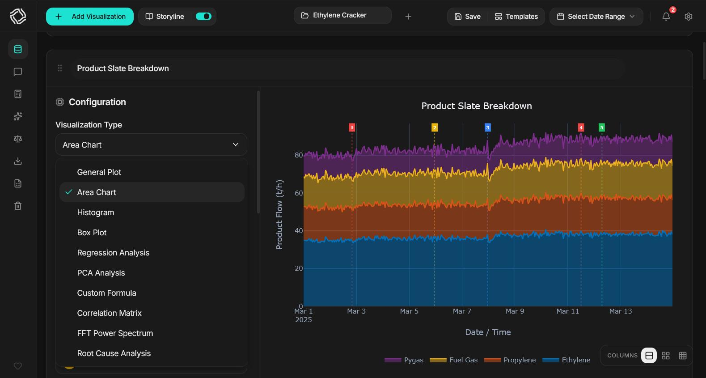
<br><sub><em>Visualization type selector — 11 chart types, each with a dedicated config panel</em></sub>

</div>

<br>

| Type | Internal ID | Description | Best For |
|:-----|:-----------|:------------|:---------|
| **General Plot** | `universal` | Line, Scatter, Bar, Step, or Line+Scatter with per-series customization | Time-series trends, comparative analysis |
| **Area Chart** | `area` | Filled area plots with optional stacking | Cumulative flows, composition breakdowns |
| **Histogram** | `hist` | Distribution analysis with configurable bin count and KDE overlay | Understanding data spread and shape |
| **Box Plot** | `box` | Statistical summaries: quartiles, medians, outliers | Comparing distributions across categories |
| **Regression Analysis** | `regression` | Dedicated regression view with model selection, equation display, and prediction panel | Correlating variables, predictive modeling |
| **PCA Analysis** | `pca` | Principal Component Analysis with loadings display and explained variance | Dimensionality reduction, pattern discovery |
| **Custom Formula** | `formula` | Plot calculated expressions using Python-like syntax | Derived metrics, efficiency calculations |
| **Correlation Matrix** | `correlation` | Color-coded heatmap of pairwise variable correlations | Identifying related variables at a glance |
| **FFT Analysis** | `fft` | Frequency spectrum analysis with Hann windowing, overlap, and detrending | Detecting periodic signals, vibration analysis |
| **Root Cause Analysis** | `root_cause` | Multi-method causality detection (Pearson, cross-correlation, mutual info, Granger) | Finding which variables drive a target variable |
| **KPI / Summary** | `kpi` | Responsive card grid of aggregated scalars (sum, avg, min, max, median, count, first, last, std, or custom formula) with per-metric unit, decimals, and color | Dashboard tiles, period totals, headline numbers |

> [!NOTE]
> The **General Plot** (`universal`) type supports four render modes per series: `line`, `scatter`, `bar`, and `step`. The `PlotType` enum (used in axis configuration for multi-axis overlays) contains three modes: `Line`, `Scatter`, and `Line + Scatter`. These are distinct from the per-series render types available in the General Plot.

---

### 🖱️ Interactive Chart Features

Every chart is rendered by **Plotly.js** and includes a full suite of interactive controls out of the box.

<br>

<div align="center">

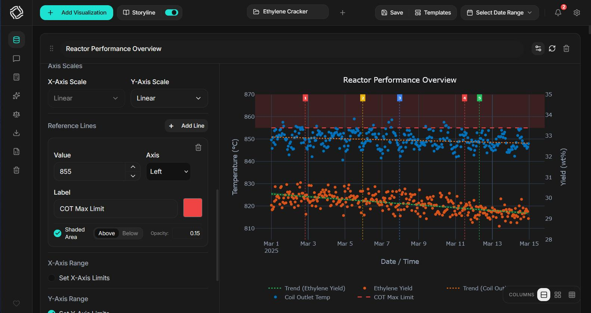
<br><sub><em>Dual Y-axis chart with threshold lines, per-series colors, trendlines, and event markers</em></sub>

</div>

<br>

- **Per-Series Styling** — Each series has its own color picker, chart type selector (line/scatter/bar/step), and Y-axis assignment (left or right)
- **Per-Series Trendlines** — Toggle individual regression trendlines per series, with confidence interval bands and IQR-based outlier removal
- **Dual Y-Axes** — Overlay variables with different units and scales on the same chart
- **Interactive Zoom & Pan** — Click and drag to zoom into transient events; double-click to reset
- **Threshold Lines** — Add horizontal reference lines with optional shaded regions above or below
- **Custom Legend Labels** — Rename series legends with debounced input for presentation-ready charts
- **Storyline Event Markers** — Overlay vertical event markers from the Storyline feature on time-series plots
- **Drag & Drop Reorder** — Rearrange visualization cards by dragging (powered by dnd-kit)
- **Responsive Grid** — Switch between 1, 2, or 3 column layouts via floating controls
- **Dark Mode & Themes** — Theme-aware rendering with multiple color themes and light/dark mode toggle
- **LTTB Downsampling** — Automatic Largest Triangle Three Buckets downsampling (500-point threshold) for smooth rendering of massive datasets
- **Logarithmic Axes** — Both X and Y axes support linear and logarithmic scales
- **Lazy Loading** — Plotly library is lazy-loaded to keep initial bundle size small

> [!TIP]
> Use the **per-chart date range filter** to zoom into a specific incident window without losing your other chart configurations. A global date range filter is also available in the sidebar.

---

### 🧮 Formula Engine

The formula engine lets you write **Python-like expressions** directly in the application — no coding environment, terminal, or `pip install` required.

<br>

<div align="center">

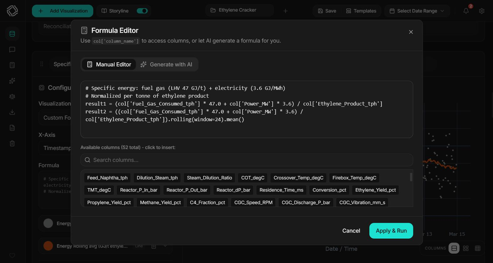
<br><sub><em>Formula editor with column browser, AI generation tab, and per-result configuration panel</em></sub>

</div>

<br>

```python
# Thermal efficiency from measured process data
efficiency = (col['Power_Output'] / (col['Fuel_Flow'] * 42000)) * 100

# Smooth noisy temperature readings with a 30-point rolling average
temp_smooth = col['Exhaust_Temp'].rolling(window=30).mean()

# Mass balance residual to detect leaks
residual = col['Inlet_Flow'] - col['Outlet_Flow'] - col['Accumulation']

# Flag alarm conditions
alarm = np.where(col['Temp_Reactor'] > 420, 1, 0)

# Convert timestamps to elapsed hours
hours = (col['Timestamp'] - col['Timestamp'].iloc[0]).dt.total_seconds() / 3600

# Multiple named outputs plotted on the same chart
result1 = col['Pressure'] * col['Volume'] / col['Temperature']  # Ideal gas product
result2 = col['Flow_In'] - col['Flow_Out']                       # Net flow balance
```

| Category | Available Functions |
|:---------|:-------------------|
| **Math** | `sin`, `cos`, `tan`, `exp`, `log`, `log10`, `sqrt`, `power`, `abs`, `ceil`, `floor` |
| **Statistics** | `mean`, `std`, `var`, `min`, `max`, `median`, `cumsum`, `cumprod` |
| **Pandas** | `.rolling()`, `.diff()`, `.shift()`, `.cumsum()`, `.interpolate()`, `.fillna()` |
| **Conditional** | `np.where()`, `np.select()`, boolean indexing |
| **Date/Time** | `.dt.total_seconds()`, `.dt.hour`, `.dt.dayofweek`, date arithmetic |
| **Namespace** | `col` (DataFrame), `np` (NumPy), `pd` (Pandas), plus all defined Global Variables |

**Formula editor features:**
- Access any column via `col['ColumnName']` — names are **case-sensitive**
- Assign to `result`, `result1`, `result2`, etc. for multiple simultaneous outputs on one chart
- **Column browser** with search and one-click insertion at cursor position
- **Per-result configuration**: chart type, color, Y-axis assignment, individual regression trendline
- **AI formula generation** tab: describe your calculation in plain English, receive working formula code (requires API key)
- Custom X-axis formula (`x_formula`) for computed horizontal axes

> [!TIP]
> Global Variables you define are automatically added to the formula namespace. Chain calculations: define `Delta_T` as a global variable, then reference `col['Delta_T']` in any formula or subsequent global variable without recomputing it.

---

### 📈 Regression Analysis Engine

A full-featured regression engine with **6 standard models** plus **custom formula fitting** via `scipy.optimize.curve_fit`.

<br>

<div align="center">

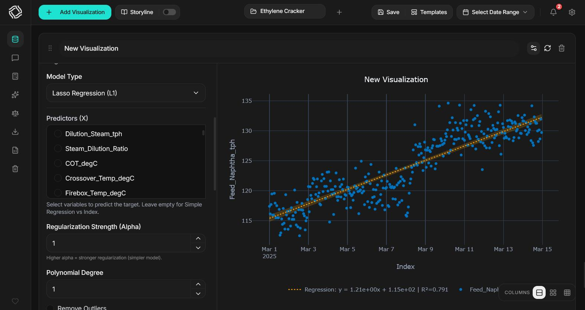
<br><sub><em>Regression panel showing model selection, fitted equation, R²/MSE metrics, and 95% CI bands</em></sub>

</div>

<br>

<table>
<tr>
<td width="50%">

**Standard Models**

| Model | Description |
|:------|:------------|
| **Linear** | OLS with R², MSE, MAE and equation display |
| **Polynomial** | Curve fitting up to degree 5 |
| **Ridge (L2)** | L2 regularization to prevent overfitting |
| **Lasso (L1)** | L1 regularization with feature selection |
| **Elastic Net** | Blended L1 + L2 regularization |
| **Random Forest** | Ensemble method for nonlinear patterns |

</td>
<td width="50%">

**Custom Formula Fitting**

Define arbitrary mathematical models:

```
y = a * exp(-b * x) + c
y = a * sin(b * x + c) + d
y = a / (1 + exp(-b * (x - c)))
```

- Custom parameter names (`a`, `b`, `c`, ...)
- Initial guesses for optimization
- Lower/upper bounds per parameter
- Reference other columns via `col['Name']`
- Powered by `scipy.optimize.curve_fit`

</td>
</tr>
</table>

**Regression capabilities:**
- **Multi-Variable Regression** — Predict Y from multiple X predictor variables simultaneously
- **Confidence Intervals** — 95% CI bands displayed around regression curves
- **Outlier Removal** — IQR-based filtering with configurable multiplier
- **Robust Regression** — Non-linear loss functions: `soft_l1`, `huber`, `cauchy`, `arctan`
- **Optimization Methods** — Choose solver: `trf` (Trust Region), `lm` (Levenberg-Marquardt), `dogbox`
- **Equation Display** — Fitted equation shown in the UI, ready to copy
- **Quality Metrics** — R², MSE, MAE computed and displayed for every model
- **Date Handling** — Date/time columns automatically converted to numeric for regression
- **Model Persistence** — Save and reload fitted models via the `/api/v1/models` API
- **Prediction** — Use fitted models to predict Y for new X inputs

> [!TIP]
> For noisy industrial data, try **Ridge** or **Elastic Net** before increasing polynomial degree. Regularization often gives better generalization than overfitting with a high-degree polynomial.

---

### ⚖️ Data Reconciliation

Enforce **physical constraints** — mass balances, energy balances, stoichiometric relationships — using constrained least-squares optimization.

<br>

<div align="center">

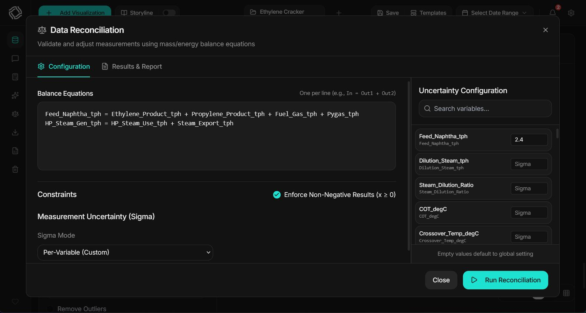
<br><sub><em>Reconciliation modal: constraint equation editor, sigma configuration, and per-variable error report</em></sub>

</div>

<br>

**How it works:**

1. Define constraint equations using your column names:
   ```
   Inlet_Flow = Outlet_Flow + Accumulation
   Steam_Generation = Steam_Consumption + Losses
   Feed_A + Feed_B = Product + Waste + Recycle
   ```
2. FlowMeter solves for the **minimum-variance adjustment** to your measured values that satisfies all constraints simultaneously
3. Results include per-variable error statistics and a downloadable reconciled dataset (`.xlsx`)

| Option | Description |
|:-------|:------------|
| **Fixed Sigma** | Apply uniform measurement uncertainty across all variables |
| **Per-Variable Sigma** | Specify different uncertainties for each variable (e.g., flowmeters vs. thermocouples) |
| **Non-Negativity** | Constrain reconciled values to be ≥ 0 |

> [!TIP]
> FlowMeter uses two solver strategies: a **vectorized analytical solution** (fast closed-form) when non-negativity is disabled, and the **OSQP quadratic programming solver** with warm-starting when non-negativity constraints are enabled. Constraint equations are parsed symbolically with **SymPy** and column names are matched using canonical normalization (tolerant of spaces and special characters).

> [!WARNING]
> If reconciliation diverges or reports infeasibility, check that your constraints are **linearly independent**. Including a redundant constraint that is a linear combination of others (e.g., writing `A = B + C` and `B = A - C`) will cause OSQP to fail.

---

### 🧹 Data Cleaning & Preprocessing

The **Onboarding Wizard** walks you through a data preparation pipeline in 4 steps, applied in order.

<br>

<div align="center">

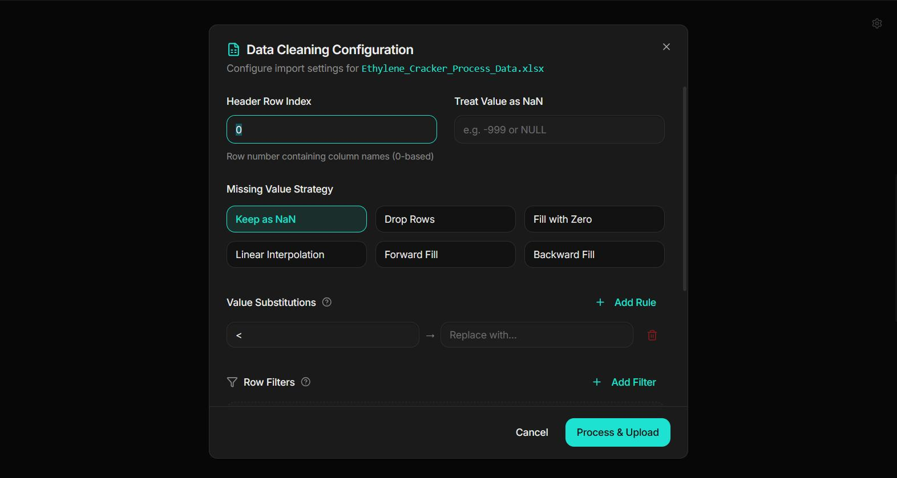
<br><sub><em>Onboarding Wizard: upload → preprocessing → path selection → advanced config</em></sub>

</div>

<br>

| Step | What Happens |
|:-----|:------------|
| **Step 1: Upload** | Drag-and-drop a `.csv`, `.xlsx`, or `.xls` file (up to 50 MB). Column types detected automatically. |
| **Step 2: Preprocessing** *(optional)* | **Header row** — skip metadata rows at the top. **Value replacements** — regex substitution across columns (e.g., `"1,5"` → `"1.5"`). **Row filters** — keep or remove rows based on column value conditions using 6 numeric and 2 string operators. **Custom NaN** — treat specific sentinel values (e.g., `-999`, `#REF!`) as missing. **NaN strategy** — `drop`, `fill_zero`, `interpolate`, `fill_forward`, `fill_backward`, or `none`. **Resampling** — aggregate to fixed time intervals using `mean`, `sum`, `min`, `max`, `first`, `last`, or `median`. |
| **Step 3: Getting Started Choice** | Choose **Import Template** (load a saved config), **Start from Scratch** (manual setup), or **AI-Assisted** (let AI suggest charts). |
| **Step 4: Advanced Config** *(Scratch path only)* | Optionally configure **Data Reconciliation** constraints and **Global Variables** before the main dashboard loads. Both are also accessible from the sidebar at any time. |

> [!NOTE]
> Preprocessing is entirely optional. If your data is clean, skip Step 2 and go straight to visualization. All preprocessing settings are saved in templates so you configure them once.

---

### 📁 Templates & Saved Configurations

Save your entire dashboard configuration — all visualizations, formulas, reconciliation settings, global variables, annotations, and comments — as a reusable **template**.

<br>

<div align="center">

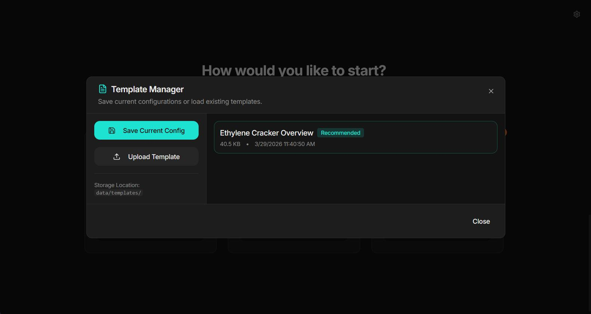
<br><sub><em>Template manager: browse, apply, export, and import dashboard configurations</em></sub>

</div>

<br>

- **Persistent Storage** — Templates saved as JSON files in `backend/data/templates/`, available across sessions
- **Auto-Detect Required Variables** — Templates extract which dataset columns are needed, validating against new datasets before loading
- **Export/Import** — Download templates as `.json` for backup; upload to restore on another machine
- **Full CRUD** — Browse, rename, delete, and duplicate saved templates from the sidebar
- **AI Guidance** — Templates can include natural-language guidance text sent to the AI along with column metadata

> [!TIP]
> **The "configure once, reuse always" pattern:** Build a "Weekly Reactor Performance" template with all your standard charts, formulas, and reconciliation rules. Every Monday, upload the new export and apply the template — your complete dashboard is ready in seconds.

---

### 🔢 Global Variables

Define **computed columns** that are available across all visualizations in the dashboard simultaneously.

```python
# These appear as new columns selectable in every chart
Efficiency   = (col['Power_kW'] / col['Fuel_Flow_kg_s'] / 43000) * 100
Delta_T      = col['T_Outlet'] - col['T_Inlet']
Mass_Balance = col['Feed_Flow'] - col['Product_Flow'] - col['Waste_Flow']
Heat_Duty    = col['Flow_Rate'] * col['Cp'] * col['Delta_T']   # References Delta_T above
```

- Global variables appear as new columns selectable in any chart's Y-axis, formulas, and regression
- Computed **in definition order** — later variables can reference earlier ones for chained calculations
- Each variable has an optional **description** field for documentation
- Accessible from the Onboarding Wizard (Step 4) and from the dashboard sidebar at any time
- Saved in templates and restored on load

> [!NOTE]
> Global variables are evaluated against the full (preprocessed) dataset. Reference them in any formula using `col['VariableName']` exactly as you would any dataset column.

---

### 📄 Professional HTML Reports

Export your dashboard as a **self-contained HTML file** that anyone can open in any browser.

<br>

<div align="center">

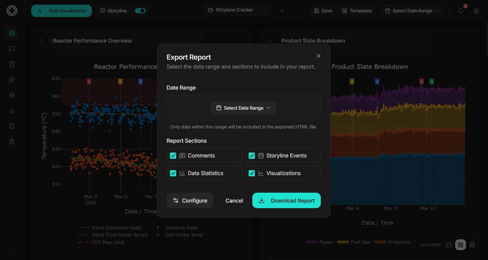
<br><sub><em>Generated HTML report with custom branding, statistics table, and embedded charts</em></sub>

</div>

<br>

- **Standalone** — Single `.html` file with all charts embedded as base64 PNG images and all CSS inlined
- **Zero Dependencies** — No server, no internet, no software required to open
- **High Quality** — Charts rendered server-side via Plotly + Kaleido at crisp resolution
- **Customizable Branding** — Author name, job title, location, custom logo (base64 upload), primary and secondary accent colors
- **Statistical Summary** — Auto-generated statistics table (mean, std, min, max) for all visualized columns
- **Per-Chart Notes** — Add comments to each visualization that appear in the final report
- **Storyline Events** — Timeline annotations included in the exported report
- **Date Range** — Optionally restrict the report to a specific date/time window

> [!NOTE]
> Reports are generated using Jinja2 templates with **parallel chart rendering** via `ThreadPoolExecutor`. Even dashboards with dozens of charts export in seconds. Kaleido is prewarmed on application startup to minimize first-export latency.

---

### 🤖 AI-Powered Suggestions

FlowMeter integrates AI through a **LangGraph workflow** with structured output validation and automatic correction loops.

<br>

<div align="center">

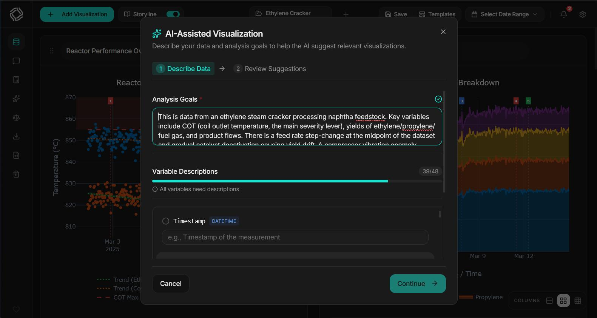
<br><sub><em>AI Suggestions Panel: provider/model selection, natural-language description, suggested visualizations</em></sub>

</div>

<br>

**Supported providers:**

| Provider | Description |
|:---------|:------------|
| **Google Gemini** | Gemini model family via Google AI Studio |
| **OpenAI** | GPT and o-series models |
| **Anthropic Claude** | Claude model family |

Models are **fetched dynamically** from each provider's API when you enter your API key — no hardcoded lists. You always see the latest models available to your account.

**AI capabilities:**
- **Visualization Suggestions** — Describe your data in plain English; AI proposes chart configurations you review and apply with one click (per suggestion or **Apply All**)
- **Formula Generation** — Describe a calculation; AI writes the Python formula code (integrated in the Formula Editor)
- **Dynamic Model Discovery** — Available models fetched in real-time from provider APIs, so new models appear automatically
- **Reasoning Effort Control** — Adjust AI thinking depth (Low / Medium / High) to balance speed vs. quality; maps to provider-specific features (Anthropic extended thinking, OpenAI reasoning effort, Gemini thinking budget)
- **Structured Output** — AI responses validated against Pydantic schemas with automatic retry and self-correction
- **Column Validation** — AI-suggested column names cross-checked against your actual dataset, with fuzzy-match correction hints
- **Context-Aware** — AI receives your column names, data types, sample statistics, and any guidance text you provide
- **Dataset Profile (always on)** — A server-computed profile grounds every suggestion in the real data: per-column role (numeric / categorical / datetime / boolean / identifier / constant), null %, cardinality, skew, example values, datetime-like text columns, the best timestamp candidate, and strong correlation pairs (|r| ≥ 0.7). Sent as aggregates (plus a few example values) — no full rows
- **Dataset Access (Agentic Tools)** — *Optional.* Let the AI issue read-only tool calls against the loaded dataset — starting with a one-shot `overview()` profile, then drilling in with sample rows, value counts, correlations, group-by aggregates, quantiles, outlier counts, and more — so it grounds suggestions in the live data rather than metadata alone. **Off by default**; the agent-loop iteration cap is configurable in AI Settings
- **Formula Verification (closed-loop)** — In dataset-access mode the AI can `test_formula` a candidate expression — executing it on a sample to confirm it runs and preview its output (with auto-correction for `^`→`**`, a missing `result =`, or fuzzy-matched column names) — *before* proposing a formula chart or formula KPI, so suggested formulas are verified rather than guessed

> [!IMPORTANT]
> AI features are **optional** and require your own API key from the chosen provider. FlowMeter works fully without AI. All API calls go directly from your machine to the AI provider — FlowMeter has no telemetry, no intermediary servers, and no data collection.

---

### 📅 Storyline & Annotations

Add **timeline event annotations** to your charts for documenting process incidents, maintenance events, and recipe changes.

<br>

<div align="center">

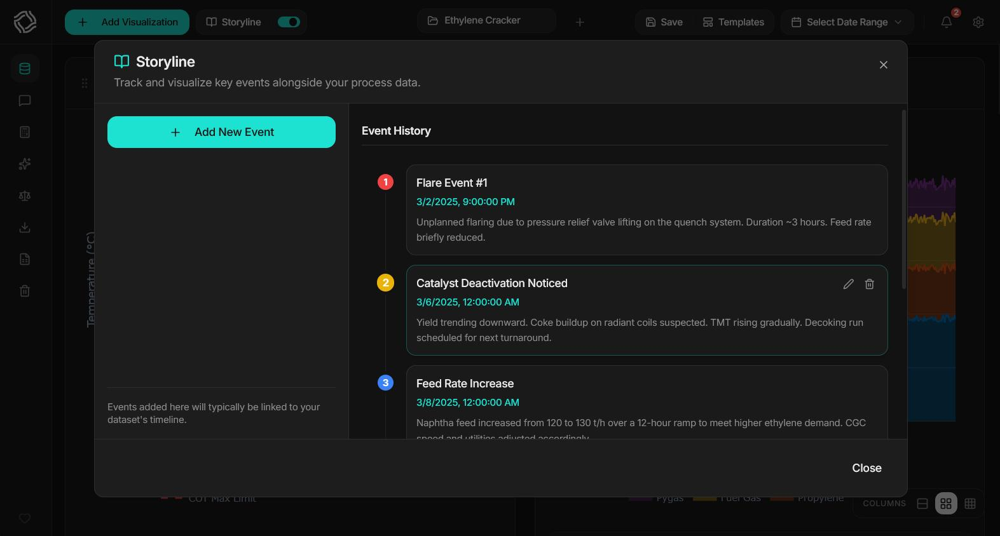
<br><sub><em>Storyline modal: event entry form on left, vertical timeline on right, chart markers overlaid on plots</em></sub>

</div>

<br>

- **Two-Pane Modal** — Event entry form on left, vertical scrollable timeline on right
- **Event Fields** — Date/time picker, title, description, and custom color marker
- **Full CRUD** — Add, edit, and delete events; hover-based action buttons
- **Chart Integration** — Events appear as colored vertical lines on time-series plots with hover tooltips
- **Color Categorization** — Use different colors for event types (red for upsets, yellow for maintenance, blue for recipe changes)
- **Template Persistence** — Storyline events are saved in templates and included in exported HTML reports
- **Auto-Sorting** — Timeline always displays events newest-first

---

## Quick Start

### Option 1: Pre-Built Executable *(Recommended for non-developers)*

The fastest way to get started — no Python, Node.js, or development tools required:

1. Download the latest release from [GitHub Releases](https://github.com/sommaa/flowmeter/releases)
2. Extract the archive to a folder of your choice
3. Run the executable:
   - **Windows**: double-click `FlowMeter.exe`
   - **Linux**: `chmod +x FlowMeter && ./FlowMeter`
4. Your default browser automatically opens to `http://127.0.0.1:8000`

**That's it.** One file, double-click, done.

> [!NOTE]
> The executable bundles the FastAPI backend and compiled React frontend together. When you run it, the backend starts on port 8000 and automatically serves the frontend. If port 8000 is already in use, set the `PORT` environment variable before launching: `PORT=8001 ./FlowMeter`.

---

### Option 2: Run from Source *(Recommended for developers)*

**Step 1 — Clone the repository:**

```bash
git clone https://github.com/sommaa/flowmeter.git
cd flowmeter
```

**Step 2 — Start the backend:**

```bash
cd backend
python -m venv venv

# Activate virtual environment:
# Windows PowerShell:  venv\Scripts\Activate.ps1
# Windows CMD:         venv\Scripts\activate.bat
# Linux / macOS:       source venv/bin/activate

pip install -r requirements.txt
uvicorn app.main:app --reload --port 8000
```

**Step 3 — Start the frontend** (separate terminal):

```bash
cd frontend
npm install
npm run dev
```

| Service | URL | Notes |
|:--------|:----|:------|
| Frontend (dev) | `http://localhost:3000` | Hot Module Replacement enabled |
| Backend API | `http://localhost:8000` | Auto-reloads on code changes |
| API Docs (Swagger) | `http://localhost:8000/docs` | Interactive API explorer |
| API Docs (ReDoc) | `http://localhost:8000/redoc` | Clean reference view |

The frontend dev server proxies all `/api` requests to the backend at port 8000 automatically.

**Quick Start Script (Linux/macOS):**

```bash
chmod +x start.sh
./start.sh
# Starts both backend and frontend in a single command
```

---

### Option 3: Docker Compose

```bash
docker-compose up
```

This starts both services:
- **Frontend** at `http://localhost:3000`
- **Backend API** at `http://localhost:8000`
- **API Docs** at `http://localhost:8000/docs`

---

## User Guide

This section walks first-time users through every major feature, step by step.

### Step 1: Import Your Data

**What you need:** A `.csv`, `.xlsx`, or `.xls` file with your process data.

1. When you first launch FlowMeter, the **Onboarding Wizard** appears automatically
2. Click **Upload File** or drag and drop your file onto the upload zone
3. Wait for the file to parse — the app shows detected column names, row count, and data types

**What you'll see:** A file info summary showing rows, columns, detected types, and date range (if a timestamp column was found).

**Expected data structure:**
- Row 0 (by default): column headers
- Columns: variables, sensors, measurements, parameters
- Rows: time points or samples
- Optional: a `Date`, `Timestamp`, or `Time` column unlocks time-series features

> [!TIP]
> If your file has metadata rows at the top (plant name, report date, etc.) before the actual headers, use the **Header Row** setting in Step 2 to skip them.

---

### Step 2: Clean Your Data *(Optional)*

If your data needs preprocessing, configure it in the wizard's Step 2 panel:

1. **Header Row** — Set which row index contains column names (0-based)
2. **Value Replacements** — Fix locale issues: replace `,` with `.` in numbers, remove unit strings, etc.
3. **Row Filters** — Remove outlier timestamps, filter to a specific operating mode, or exclude shutdown periods
4. **Custom NaN Values** — Tell FlowMeter to treat `-999`, `N/A`, or `#REF!` as missing data
5. **NaN Strategy** — Choose how to handle missing values: drop, interpolate, forward-fill, etc.
6. **Resampling** — Aggregate high-frequency data (e.g., 1-second → 1-minute means)

**What you'll see:** A live data preview that updates as you configure each option.

> [!NOTE]
> All preprocessing settings are saved in templates, so you only configure them once per data format.

---

### Step 3: Choose Your Path

After preprocessing, select how to start the dashboard:

<table>
<tr>
<td width="33%">

**Import Template**

Load a previously saved dashboard configuration. All charts, formulas, and reconciliation rules are applied automatically.

Best for: **recurring reports** with the same data structure.

</td>
<td width="33%">

**Start from Scratch**

Build your dashboard manually. You can optionally configure Data Reconciliation and Global Variables before the main view loads.

Best for: **first-time exploration** of a new dataset.

</td>
<td width="33%">

**AI-Assisted**

Describe your data and what you're analyzing. AI suggests an initial set of visualizations based on your column names and description.

Best for: **unfamiliar datasets** where you're unsure what to look at first.

</td>
</tr>
</table>

---

### Step 4: Create Your First Chart

1. Click **Add Visualization** in the dashboard header
2. Select a **Visualization Type** from the dropdown (start with **General Plot**)
3. Choose your **X-Axis**: a timestamp column, `Index` (row number), or a custom formula
4. Select one or more **Y-Axis Variables** from your dataset columns
5. The chart appears immediately — no submit button needed

**What you'll see:** A Plotly chart card with a configuration panel. Hover the card to reveal expand, duplicate, and delete controls.

> [!TIP]
> Click the card title to rename it. Descriptive names like "Reactor Temperature vs. Feed Rate" make exported reports much more readable.

---

### Step 5: Customize Your Charts

With a chart created, explore the configuration panel on the right side of each card:

1. **Per-Series Settings** — Click a series name to expand: change color, switch line/scatter/bar/step, assign to left or right Y-axis
2. **Dual Y-Axis** — Enable the secondary Y-axis and assign selected series to it for variables with different scales
3. **Add Trendline** — Toggle per-series regression trendline; configure model type, degree, and confidence interval
4. **Threshold Lines** — Add horizontal reference lines (alarm limits, spec limits) with optional shaded regions
5. **Date Range Filter** — Restrict this specific chart to a particular time window
6. **Notes** — Add per-chart comments that appear in exported reports

> [!TIP]
> The floating control panel (bottom-right corner) lets you switch between 1, 2, and 3 column grid layouts. Drag visualization cards to reorder them on the dashboard.

---

### Step 6: Use the Formula Engine

1. Create a new visualization and select **Custom Formula** as the type
2. Click **Open Formula Editor** to open the full-screen formula modal
3. Write your formula using Python syntax:
   ```python
   result = (col['T_Out'] - col['T_In']) / col['Q_Input'] * 100
   ```
4. Click **Run** — the result is plotted immediately
5. Optionally switch to the **AI tab** to describe your formula in plain English and receive generated code

**Column browser:** Click any column name in the browser panel to insert it at the cursor position.

> [!WARNING]
> Column names are **case-sensitive**. If you get a `KeyError`, verify the exact column name in the column browser. Do not use `col.ColumnName` — always use `col['ColumnName']`.

---

### Step 7: Run Regression Analysis

1. Create a new visualization and select **Regression Analysis** as the type
2. Select your **Y variable** (what to predict) and **X predictor(s)**
3. Choose a **Model Type**: Linear, Polynomial, Ridge, Lasso, Elastic Net, Random Forest, or Custom Formula
4. For **Custom Formula**: write your equation (e.g., `a * exp(-b * x) + c`), enter initial guesses and bounds
5. The fitted equation, R², MSE, and MAE appear in the panel below the model selector
6. Toggle **Show Confidence Interval** for 95% CI bands
7. Click **Save Model** to persist the fitted model for future prediction

> [!TIP]
> For multi-variable regression, select multiple X predictor columns. The model trains on all predictors simultaneously and reports combined R² and MSE for the multi-predictor fit.

---

### Step 8: Set Up Data Reconciliation

1. Open the **Reconciliation** panel from the sidebar or from Step 4 of the Onboarding Wizard
2. Add constraint equations, one per line:
   ```
   Feed = Product + Waste
   Steam_Gen = Steam_Use + Losses
   ```
3. Set **Sigma Mode**:
   - **Fixed All** — uniform uncertainty for all variables
   - **From Config** — enter per-variable sigma values in the table that appears
4. Enable **Non-Negativity** if flow values must be ≥ 0
5. Click **Run Reconciliation**
6. Review the error report: mean error, MAE, relative error %, standard deviation, and max absolute change per variable
7. Click **Download Results** to get the reconciled dataset as an Excel file (`.xlsx`)

> [!WARNING]
> Constraint equations must use column names that match your dataset. If reconciliation reports infeasibility, verify your constraints are linearly independent and variable names are spelled correctly.

---

### Step 9: Save a Template

1. Click the **Templates** button in the sidebar
2. Click **Save Current Configuration** and give your template a descriptive name
3. The template saves to `backend/data/templates/` and persists across sessions
4. To reuse: upload a new dataset → **Import Template** → select your template

**Template includes:** all visualizations, global variables, reconciliation constraints, storyline events, column descriptions, preprocessing settings, and AI guidance text.

> [!TIP]
> Use **Export Template** to download the JSON file and share with colleagues. They can **Import Template** on their own FlowMeter instance to instantly replicate your dashboard.

---

### Step 10: Export a Report

1. Click the **Export** button in the header bar
2. Fill in the **Export Settings** modal:
   - Author name, job title, location
   - Optional custom logo (upload an image — converted to base64 automatically)
   - Primary and secondary accent colors (hex codes)
3. Click **Generate Report**
4. A standalone `.html` file downloads to your machine
5. Open in any browser — no software, internet, or server required
6. Share with colleagues via email or file transfer

> [!NOTE]
> The exported HTML file is truly standalone: all charts are embedded as base64 PNG images, all CSS is inlined. File size depends on chart count — typically 1–5 MB for a 10-chart dashboard.

---

## FAQ

**Q: Does FlowMeter require an internet connection?**

No. FlowMeter runs entirely on your machine. The only time it connects to the internet is when you use AI features, which sends your column names and description to the AI provider's API. All other features — visualization, regression, reconciliation, export — work fully offline.

---

**Q: How large a dataset can FlowMeter handle?**

The upload limit is 50 MB by default (configurable via `MAX_FILE_SIZE_MB`). FlowMeter has been tested with datasets of several hundred thousand rows. For display, LTTB downsampling automatically reduces rendered points to 500 per series. For processing (formulas, regression, reconciliation), the full dataset is used.

---

**Q: Can I use FlowMeter with data from a database or historian?**

Not directly — FlowMeter accepts file uploads only (CSV/Excel). Export your data from your historian or database as CSV or Excel, then upload it. If you need programmatic data loading, the `/api/v1/data/upload` endpoint can be called directly from scripts.

---

**Q: What happens to my data if I close the browser tab?**

Your dataset stays loaded in the backend (in memory) until the backend process stops. Reopen the browser and navigate to `http://localhost:8000` (or `localhost:3000` in dev mode) — your data is still available for the current session. Templates you saved persist indefinitely as JSON files on disk.

---

**Q: Can multiple users access the same FlowMeter instance?**

FlowMeter is designed as a single-user desktop application. It has no authentication and stores datasets in memory rather than a database. Running it as a shared server is not recommended — each user should run their own instance.

---

**Q: Why is the formula result NaN?**

The most common causes:
1. **Column name typo** — names are case-sensitive; use the column browser to insert exact names
2. **Missing data propagation** — NaN in input columns propagates to output; use `.fillna(0)` or choose an NaN strategy during preprocessing
3. **Division by zero** — protect with `np.where(col['Denominator'] != 0, col['Numerator'] / col['Denominator'], np.nan)`

---

**Q: The AI provider is not responding — what do I check?**

1. Verify your API key is correct and has not expired
2. Check that the key has permission to access the selected model
3. Verify your network connection — all AI calls go directly from your machine to the provider
4. Try a different provider or model
5. Check the provider's status page for outages (`401` = bad key, `429` = rate limited)

---

**Q: Can I use FlowMeter on macOS?**

The pre-built executables target Windows and Linux. macOS users can run from source (Option 2 in Quick Start). The Python backend and Node.js frontend both work on macOS without modification. The `scripts/build_app.sh` build script also works on macOS.

---

## Configuration Reference

FlowMeter is configured via environment variables. Create a `.env` file in the `backend/` directory to override defaults. A `.env.example` file is provided as a starting point.

```bash
cp backend/.env.example backend/.env
# Edit backend/.env with your preferred settings
```

| Variable | Default | Description |
|:---------|:--------|:------------|
| `APP_NAME` | `FlowMeter API` | Application display name shown in API docs and logs |
| `APP_VERSION` | `1.0.0-alpha` | Semantic version string |
| `DEBUG` | `false` | Enable debug mode — verbose logging, full error tracebacks in API responses |
| `HOST` | `0.0.0.0` | Server bind address (`0.0.0.0` = all network interfaces) |
| `PORT` | `8000` | Listening port for the FastAPI/Uvicorn server |
| `CORS_ORIGINS` | `["http://localhost:3000","http://localhost:5173"]` | Allowed CORS origins for the frontend (JSON array) |
| `MAX_FILE_SIZE_MB` | `50` | Maximum upload file size in megabytes |
| `ALLOWED_EXTENSIONS` | `[".xlsx",".xls",".csv"]` | Accepted file extensions (JSON array) |
| `UPLOAD_DIR` | `uploads` | Directory for temporary file storage during upload processing |
| `MAX_DATASETS_PER_SESSION` | `10` | Maximum number of datasets that can be loaded simultaneously |

> [!NOTE]
> All settings use Pydantic Settings with automatic type conversion and validation. Variable names are case-insensitive. See `backend/app/core/config.py` for the complete `Settings` class.

---

## Technical Reference

<details>
<summary><strong>🏗️ Architecture Overview</strong></summary>

<br>

FlowMeter uses a **decoupled client-server architecture** optimized for local deployment and packaging as a standalone executable.

```
┌──────────────────────────────────────────────────────────────────┐
│                    FlowMeter Application                          │
├──────────────────────────────┬───────────────────────────────────┤
│        Frontend (UI)         │        Backend (API)               │
├──────────────────────────────┼───────────────────────────────────┤
│  React 19 + TypeScript 5.4   │  FastAPI 0.115+ (Python 3.10+)   │
│  Vite 7 (build / HMR)        │  Uvicorn (ASGI server)            │
│  Plotly.js 2.28 (charts)     │  Pandas + NumPy (data)            │
│  Zustand 5.0 (state)         │  Scikit-Learn (ML models)         │
│  Radix UI (components)       │  SciPy (curve fitting)            │
│  dnd-kit (drag-and-drop)     │  SymPy + OSQP (reconciliation)    │
│  TailwindCSS (styling)       │  Kaleido (PNG rendering)          │
│  Axios (HTTP client)         │  Jinja2 (report templates)        │
│  Lucide (icons)              │  LangChain + LangGraph (AI)       │
└──────────────────────────────┴───────────────────────────────────┘
             │                              │
             │    REST API (JSON)           │
             │◄────────────────────────────►│
             │                              │
             └──────────────┬───────────────┘
                            │
                PyInstaller / Docker / Gunicorn
                            │
               Single Executable or Container
```

**Middleware stack (execution order):**

1. `CORSMiddleware` — adds CORS headers for browser cross-origin requests
2. `ProcessTimeMiddleware` — adds `X-Process-Time` header (request profiling)
3. `GZipMiddleware` — compresses responses > 1000 bytes (significant for large JSON payloads)

**Design principles:**

| Principle | Implementation |
|:----------|:--------------|
| **Local-First** | All processing on your machine — zero mandatory cloud calls |
| **Stateless API** | Backend holds datasets in memory; all context is passed per request |
| **NaN-Safe JSON** | Custom `NaNSafeJSONResponse` converts `NaN`/`Infinity` to `null` for JSON compliance |
| **Debounced Updates** | UI config changes are debounced to prevent rendering on every keystroke |
| **Parallel Export** | Report generation uses `ThreadPoolExecutor` for concurrent chart rendering |
| **Kaleido Prewarm** | Kaleido renderer is prewarmed on startup to minimize first-export latency |
| **SPA Catch-All** | Unmatched routes serve `index.html` for React Router client-side navigation |
| **LRU Settings Cache** | `get_settings()` is cached with `@lru_cache()` to avoid repeated environment variable parsing |

**Deployment modes:**

| Mode | Command | Notes |
|:-----|:--------|:------|
| Development | `uvicorn app.main:app --reload` | Hot reload, full error tracebacks |
| Standalone Executable | `./FlowMeter` or `FlowMeter.exe` | PyInstaller bundle, no external dependencies |
| Docker | `docker-compose up` | Containerized, port-mapped services |
| Production | `gunicorn app.main:app -w 4 -k uvicorn.workers.UvicornWorker` | Multi-worker ASGI |

</details>

<details>
<summary><strong>🛠️ Full Technology Stack</strong></summary>

<br>

#### Frontend

| Technology | Version | Purpose |
|:-----------|:--------|:--------|
| React | 19.2.3 | Component-based UI with hooks |
| TypeScript | 5.4.5 | Static type safety |
| Vite | 7.2.7 | Fast dev server with HMR, optimized production builds |
| Plotly.js | 2.28.0 | Interactive, publication-quality charts |
| Zustand | 5.0.9 | Lightweight state management with slices |
| Radix UI | Latest | Accessible, unstyled UI primitives |
| Lucide React | 0.561.0 | Consistent SVG icon set |
| dnd-kit | 6.3.1 | Accessible drag-and-drop for card reordering |
| TailwindCSS | 3.4.4 | Utility-first CSS framework |
| Axios | 1.13.2 | HTTP client for API communication |
| React Dropzone | 14.2.3 | Drag-and-drop file upload zone |
| cmdk | 1.1.1 | Command palette / combobox component |
| simplebar-react | 3.3.2 | Custom scrollbar component |
| uuid | 13.0.0 | UUID generation for component keys |
| Vitest | 4.0.16 | Vite-native unit testing framework |
| @testing-library/react | 16.3.1 | Component testing utilities |
| jsdom | 27.3.0 | DOM simulation for unit tests |

#### Backend

| Technology | Version | Purpose |
|:-----------|:--------|:--------|
| FastAPI | 0.115+ | High-performance async Python web API |
| Uvicorn | 0.32+ | ASGI server with standard extras |
| Pandas | 2.2+ | DataFrame-based data manipulation |
| NumPy | 1.26+ | Numerical computing |
| Scikit-Learn | 1.5+ | Regression, PCA, preprocessing pipelines |
| SciPy | 1.13+ | Non-linear curve fitting (`curve_fit`), optimization |
| SymPy | 1.13+ | Symbolic equation parsing for reconciliation |
| OSQP | 0.6+ | Quadratic programming solver |
| Plotly | 5.18+ | Server-side chart data generation |
| Kaleido | 0.2+ | Plotly → PNG rendering for HTML reports |
| Jinja2 | 3.1+ | HTML report template engine |
| Pydantic | 2.9+ | Request/response validation (50+ schemas) |
| Pydantic-Settings | 2.6+ | Environment variable configuration |
| openpyxl | 3.1+ | Excel file reading and writing |
| xlrd | 2.0+ | Legacy `.xls` file reading |
| orjson | 3.10+ | Fast JSON serialization |
| lttbc | 0.2+ | LTTB downsampling (C extension) |
| matplotlib | 3.9+ | Supplementary plotting utilities |
| python-multipart | 0.0.12+ | Multipart file upload handling |
| PyInstaller | 6.10+ | Bundle into standalone executable |
| Pytest | 8.0+ | Test framework |
| httpx | 0.27+ | Async HTTP test client |

#### AI (Optional)

| Technology | Version | Purpose |
|:-----------|:--------|:--------|
| LangChain | 1.2+ | LLM orchestration and prompt management |
| LangGraph | 1.0+ | Stateful AI workflow graphs with retry loops |
| LangSmith | 0.1+ | Tracing and observability (optional) |
| langchain-google-genai | 2.0+ | Google Gemini integration |
| langchain-openai | 0.3+ | OpenAI GPT integration |
| langchain-anthropic | 0.3+ | Anthropic Claude integration |

</details>

<details>
<summary><strong>📁 Project Structure</strong></summary>

<br>

```
flowmeter/
├── frontend/                               # React / TypeScript application
│   ├── src/
│   │   ├── components/
│   │   │   ├── visualizations/             # Chart rendering & configuration
│   │   │   │   ├── InteractivePlot.tsx           # Main Plotly chart renderer
│   │   │   │   ├── VisualizationCard.tsx         # Card wrapper with header
│   │   │   │   ├── ConfigurationPanel.tsx        # Settings panel (right side)
│   │   │   │   ├── FormulaEditorModal.tsx        # Formula code editor modal
│   │   │   │   ├── RootCauseAnalysis.tsx         # Causality visualization
│   │   │   │   ├── controls/                     # Sub-control components
│   │   │   │   └── sections/                     # Config sub-panels (Axis, Regression, FFT, …)
│   │   │   ├── features/                   # Feature modules
│   │   │   │   ├── Dashboard/                    # Main grid layout
│   │   │   │   ├── DataManagement/               # File upload UI
│   │   │   │   ├── DataCleaning/                 # Preprocessing modal
│   │   │   │   ├── Reconciliation/               # Constraint editor modal
│   │   │   │   ├── Templates/                    # Template browser
│   │   │   │   ├── GlobalVariables/              # Global formula manager
│   │   │   │   ├── AI/                           # AI suggestion interface
│   │   │   │   └── Storyline/                    # Timeline annotations
│   │   │   ├── layout/                     # App shell (TopBar, Sidebar, Modals)
│   │   │   ├── onboarding/                 # First-time user wizard
│   │   │   ├── common/                     # Reusable UI components
│   │   │   └── ui/                         # Radix UI primitives
│   │   ├── store/                          # Zustand state management
│   │   │   ├── useStore.ts                       # Main store instance
│   │   │   ├── slices/                           # Feature-specific state slices
│   │   │   └── selectors.ts                      # Memoized selectors
│   │   ├── services/api.ts                 # Axios HTTP client & API calls
│   │   ├── hooks/                          # Custom React hooks
│   │   ├── types/                          # TypeScript type definitions (100+ types)
│   │   ├── lib/
│   │   │   ├── utils.ts                          # Utility functions (cn, formatters)
│   │   │   ├── themes.ts                         # Plotly theme definitions
│   │   │   └── constants.ts                      # App-wide constants
│   │   ├── App.tsx                         # Root component
│   │   └── main.tsx                        # Entry point
│   ├── package.json
│   ├── vite.config.ts                      # Vite config (port: 3000, proxy → 8000)
│   ├── tsconfig.json
│   ├── tailwind.config.js
│   └── Dockerfile
│
├── backend/                                # FastAPI / Python application
│   ├── app/
│   │   ├── api/                            # REST API route handlers
│   │   │   ├── data.py                           # Upload, columns, preview, statistics
│   │   │   ├── visualizations.py                 # Plot data generation & validation
│   │   │   ├── reconciliation.py                 # Constraint optimization
│   │   │   ├── templates.py                      # Template CRUD
│   │   │   ├── export.py                         # HTML report generation
│   │   │   ├── models.py                         # ML model persistence
│   │   │   └── ai.py                             # AI suggestions & formula generation
│   │   ├── services/                       # Business logic layer
│   │   │   ├── data_service.py                   # Dataset management & in-memory cache
│   │   │   ├── visualization_service.py          # Plot orchestrator
│   │   │   ├── visualization/                    # Plotting sub-services
│   │   │   │   ├── plotting.py                   # Plotly chart generation
│   │   │   │   ├── regression.py                 # ML model fitting pipeline
│   │   │   │   ├── processing.py                 # Data preprocessing
│   │   │   │   ├── fft.py                        # Frequency analysis
│   │   │   │   ├── root_cause.py                 # Causality analysis
│   │   │   │   ├── kpi.py                         # KPI / summary aggregation
│   │   │   │   └── validation.py                 # Config validation
│   │   │   ├── analytics/
│   │   │   │   └── causality.py                  # Granger causality & mutual info
│   │   │   ├── cleaning_service.py               # Data cleaning pipeline
│   │   │   ├── reconciliation_service.py         # OSQP solver integration
│   │   │   ├── export_service.py                 # Report generation orchestrator
│   │   │   ├── export_helpers/
│   │   │   │   ├── html_templates.py             # Jinja2 HTML templates
│   │   │   │   ├── plotly_renderer.py            # Kaleido PNG rendering
│   │   │   │   ├── statistics.py                 # Statistics summary generation
│   │   │   │   └── utils.py                      # Color contrast, base64 helpers
│   │   │   ├── ai_service.py                     # LangGraph AI orchestration
│   │   │   └── ai_graph/                         # AI workflow components
│   │   │       ├── graph.py                      # Workflow graph definition
│   │   │       ├── providers.py                  # Multi-provider LLM factory
│   │   │       ├── formula_generator.py          # Natural language → formula
│   │   │       ├── formula_validator.py          # Formula code validation
│   │   │       ├── validators.py                 # Output schema validators
│   │   │       ├── tools.py                       # LLM tool definitions and bindings
│   │   │       ├── prompts/                       # LLM prompt templates
│   │   │       └── schemas.py                    # Graph I/O Pydantic models
│   │   ├── models/schemas.py               # All Pydantic schemas (50+ models)
│   │   ├── core/
│   │   │   ├── config.py                         # Pydantic Settings configuration
│   │   │   ├── profiler.py                       # ProcessTimeMiddleware
│   │   │   └── responses.py                      # NaNSafeJSONResponse
│   │   └── main.py                         # FastAPI application initialization
│   ├── data/
│   │   ├── templates/                      # Persistent dashboard templates (JSON)
│   │   └── models/                         # Saved regression models
│   ├── tests/                              # Pytest suite (44 test files, 655 tests)
│   ├── run.py                              # Executable entry point
│   ├── requirements.txt                    # Python dependencies
│   ├── .env.example                        # Environment variable template
│   ├── build_linux.spec                    # PyInstaller config (Linux)
│   ├── build_windows.spec                  # PyInstaller config (Windows)
│   └── Dockerfile
│
├── docs/
│   └── images/                             # Logo (SVG) and screenshots
├── scripts/
│   ├── build.py                            # Cross-platform build script
│   ├── build_app.sh                        # Linux/macOS build script
│   ├── build_app.ps1                       # Windows PowerShell build script
│   ├── regenerate_icon.py                  # Icon (ICO) generation utility
│   ├── update_version.py                   # Version bump utility
│   └── run_tests.sh                        # Test runner script
├── start.sh                                # Development quick-start script
├── docker-compose.yaml                     # Docker Compose configuration
├── VERSION                                 # Current version string
└── README.md                               # This file
```

</details>

<details>
<summary><strong>🔌 API Endpoints Reference</strong></summary>

<br>

All endpoints are prefixed with `/api/v1/`. Interactive documentation available at `/docs` (Swagger UI) and `/redoc` (ReDoc).

#### Data Management — 6 endpoints

| Method | Endpoint | Description |
|:-------|:---------|:------------|
| `POST` | `/data/upload` | Upload CSV/XLSX file with optional cleaning configuration |
| `GET` | `/data/datasets` | List all loaded datasets with metadata |
| `GET` | `/data/datasets/{id}` | Get dataset metadata (rows, columns, types, date range) |
| `DELETE` | `/data/datasets/{id}` | Remove a dataset from memory |
| `GET` | `/data/datasets/{id}/statistics` | Descriptive statistics (mean, std, quartiles) per column |
| `GET` | `/data/datasets/{id}/preview` | Preview first N rows (default: 10) |

#### Visualizations — 5 endpoints

| Method | Endpoint | Description |
|:-------|:---------|:------------|
| `POST` | `/visualizations/plot-data` | Generate Plotly-ready chart data from a `VisualizationConfig` |
| `POST` | `/visualizations/predict` | Run regression prediction with a trained model |
| `POST` | `/visualizations/validate-config` | Validate a visualization config without rendering |
| `GET` | `/visualizations/types` | List available visualization types |
| `GET` | `/visualizations/colors` | Get the 20-color palette used for series |

#### Templates — 8 endpoints

| Method | Endpoint | Description |
|:-------|:---------|:------------|
| `GET` | `/templates/list` | List all server-side saved templates |
| `POST` | `/templates/save-persistent` | Save template to server storage (JSON file) |
| `GET` | `/templates/load-persistent/{name}` | Load a template from server by name |
| `DELETE` | `/templates/delete/{name}` | Delete a saved template |
| `POST` | `/templates/rename` | Rename an existing template |
| `POST` | `/templates/save` | Prepare template for client-side download |
| `POST` | `/templates/load` | Import template from uploaded JSON file |
| `POST` | `/templates/validate` | Validate template structure and required variables |

#### Data Reconciliation — 2 endpoints

| Method | Endpoint | Description |
|:-------|:---------|:------------|
| `POST` | `/reconcile/reconcile` | Run constrained optimization reconciliation |
| `GET` | `/reconcile/download/{filename}` | Download reconciled data as Excel file (`.xlsx`) |

#### Export — 2 endpoints

| Method | Endpoint | Description |
|:-------|:---------|:------------|
| `POST` | `/export/dashboard` | Generate self-contained HTML report with embedded charts |
| `POST` | `/export/data` | Export selected column categories (original, reconciled, global variables, formula results) to an Excel file |

#### AI — 6 endpoints

| Method | Endpoint | Description |
|:-------|:---------|:------------|
| `GET` | `/ai/providers` | List available AI providers |
| `POST` | `/ai/providers/{provider}/models` | Fetch available models from a provider's API using user's key |
| `POST` | `/ai/suggest` | Get AI-powered visualization suggestions from natural language |
| `GET` | `/ai/metrics` | Recent AI suggestion metrics (latency, tokens, cost) with aggregate statistics — no prompt text captured |
| `POST` | `/ai/apply-suggestions` | Convert AI suggestions to `VisualizationConfig` objects |
| `POST` | `/ai/generate-formula` | Generate Python formula code from natural language |

#### Models — 3 endpoints

| Method | Endpoint | Description |
|:-------|:---------|:------------|
| `GET` | `/models/list` | List saved regression models with metrics |
| `POST` | `/models/save` | Train, evaluate, and persist a regression model |
| `DELETE` | `/models/delete/{name}` | Delete a saved model |

#### System — 2 endpoints

| Method | Endpoint | Description |
|:-------|:---------|:------------|
| `GET` | `/health` | Health check (status + version) |
| `GET` | `/api/info` | API name, version, and documentation URLs |

> **Total: 34 endpoints across 8 route groups**

</details>

<details>
<summary><strong>🧪 Testing</strong></summary>

<br>

#### Backend (Pytest)

**49 test files | 977 passing tests**

```bash
# Run from the repository root directory:
backend/venv/bin/python -m pytest --rootdir=backend -q
```

| Test Module | Coverage Area |
|:------------|:--------------|
| `test_data_api.py` | Data upload, listing, preview, statistics endpoints |
| `test_data_service.py` | In-memory dataset management, column type detection |
| `test_cleaning_service.py` | Header row, filters, NaN strategies, resampling pipeline |
| `test_visualizations_api.py` | Plot data API, config validation, color palette |
| `test_viz_validation.py` | `VisualizationConfig` validation rules |
| `test_viz_processing.py` | Data pre-processing for visualization |
| `test_visualization_validation.py` | Advanced validation edge cases |
| `test_visualization_processing.py` | Chart data processing pipeline |
| `test_plotting.py` | Plotly chart generation (all 11 visualization types) |
| `test_plotting_legacy.py` | Legacy chart generation compatibility |
| `test_regression.py` | All 6 regression models + custom formula fitting |
| `test_formula_rf.py` | Random Forest with formula-derived features |
| `test_fft.py` | Frequency analysis, windowing, frequency units |
| `test_kde.py` | Kernel density estimation overlay |
| `test_hist_bins.py` | Histogram bin calculation and edge cases |
| `test_causality.py` | Granger causality, Pearson, mutual info analysis |
| `test_root_cause.py` | Root cause analysis ranking and methods |
| `test_kpi_service.py` | KPI aggregation operations, formula metrics, error isolation, formatting |
| `test_reconciliation.py` | Constraint solving, OSQP, sigma weighting |
| `test_reconciliation_api.py` | Reconciliation API endpoints |
| `test_reconciliation_service.py` | Reconciliation service business logic |
| `test_templates_api.py` | Template CRUD, validation, required variables |
| `test_export_api.py` | HTML report generation API |
| `test_export_service.py` | Report generation service |
| `test_export_statistics.py` | Statistics table generation for reports |
| `test_export_stats.py` | Export stats formatting and edge cases |
| `test_export_utils.py` | Export helper utilities |
| `test_html_templates.py` | Jinja2 HTML template rendering |
| `test_plotly_renderer.py` | Kaleido PNG rendering |
| `test_models_api.py` | Regression model persistence API |
| `test_ai_api.py` | AI suggestion and formula generation API |
| `test_ai_fetch_models.py` | Dynamic model fetching from provider APIs |
| `test_ai_service.py` | AI orchestration service |
| `test_ai_graph.py` | LangGraph workflow integration |
| `test_ai_graph_providers.py` | Provider factory, reasoning-effort/thinking-budget mapping, timeouts |
| `test_ai_graph_prompts.py` | LLM prompt templates |
| `test_ai_graph_validators.py` | AI output validators and correction logic |
| `test_ai_graph_schemas.py` | AI workflow Pydantic schemas |
| `test_ai_graph_tools.py` | AI graph tool definitions and bindings |
| `test_ai_profile.py` | Dataset profile: roles, null/cardinality/skew, datetime candidates, correlations, prompt rendering |
| `test_ai_metrics.py` | AI metrics collection, aggregation, and cost computation |
| `test_logging_filters.py` | Logging filters and redaction |
| `test_formula_generator.py` | Natural language → formula generation |
| `test_formula_validator.py` | Formula code safety validation |
| `test_main.py` | FastAPI app startup, health check, middleware |
| `test_config.py` | Settings loading and environment variables |
| `test_responses.py` | `NaNSafeJSONResponse` serialization |
| `test_schemas.py` | Pydantic schema validation |
| `test_profiler.py` | `ProcessTimeMiddleware` |

#### Frontend (Vitest + React Testing Library)

**62 test files | 824 passing tests**

```bash
# Run from the repository root directory:
npx --prefix frontend vitest run --reporter=verbose --root frontend
```

| Test Environment | Configuration |
|:----------------|:--------------|
| Test runner | Vitest 4.0.16 |
| DOM environment | jsdom 27.3.0 |
| Component testing | @testing-library/react 16.3.1 |
| User events | @testing-library/user-event 14.6.1 |
| DOM matchers | @testing-library/jest-dom 6.9.1 |
| Setup file | `frontend/src/test/setup.ts` |

Coverage areas (selected):

| Area | Test Files |
|:-----|:-----------|
| Store slices | `dataSlice`, `plotSlice`, `uiSlice`, `storylineSlice`, `workspaceSlice` |
| Store integration | `useStore`, `selectors` |
| API service | `api.test.ts` |
| Layout components | `TopBar`, `Sidebar`, `FloatingControls`, `WorkspaceTabs`, `NotificationCenter` |
| AI components | `AISuggestionsPanel`, `AIWizardModal`, `AISettingsModal`, `AIProviderIcons`, `ColumnDescriptionEditor` |
| Visualization | `InteractivePlot`, `VisualizationCard`, `ConfigurationPanel`, `FormulaEditorModal`, `RootCauseAnalysis` |
| Config sections | `AxisSettings`, `RegressionSettings`, `FFTSettings`, `FormulaSettings`, `SeriesList`, `GeneralSettings`, `RootCauseSettings` |
| Features | `DashboardGrid`, `FileUpload`, `DataCleaningModal`, `ReconciliationModal`, `GlobalVariablesModal`, `TemplateManager`, `StorylineModal` |
| Common | `Button`, `ErrorBoundary`, `DateRangePicker`, `ConfirmationModal`, `CustomColorPicker`, `SimpleTooltip`, `Logo` |
| Hooks | `useDebounce`, `useThemeEffect`, `useSidebarResize` |

</details>

<details>
<summary><strong>🔨 Building from Source</strong></summary>

<br>

FlowMeter can be compiled into a **single standalone executable** using PyInstaller. Three build options:

#### Windows (PowerShell)

```powershell
.\scripts\build_app.ps1
```

The PowerShell script handles the full build pipeline automatically:
1. Installs frontend dependencies and builds with Vite (`npm install && npm run build`)
2. Converts the SVG logo to a multi-size ICO file via a sharp → Pillow pipeline
3. Creates a Python virtual environment and installs backend dependencies
4. Runs PyInstaller with `backend/build_windows.spec`
5. Output: `backend/dist/FlowMeter.exe` (with custom icon)

#### Linux / macOS (Bash)

```bash
chmod +x scripts/build_app.sh
./scripts/build_app.sh
```

1. Runs `npm install && npm run build` for the frontend
2. Creates a Python venv and installs requirements
3. Runs PyInstaller with `backend/build_linux.spec`
4. Output: `backend/dist/FlowMeter`

#### Cross-platform (Python)

```bash
python scripts/build.py
```

Auto-detects the OS and uses the appropriate spec file. Handles npm command differences between Windows (`npm.cmd`) and Unix. Cleans previous builds before starting.

#### PyInstaller Configuration

Both `.spec` files bundle:
- **Frontend:** `frontend/dist/` → mapped as `static/` inside the executable
- **Logo assets:** `logo_white_colored.svg`, `logo_black_colored.svg`
- **Hidden imports:** uvicorn, pandas, numpy, sklearn, scipy, sympy, osqp, openpyxl, xlrd, matplotlib, kaleido, jinja2
- **Custom hooks:** `backend/hooks/hook-osqp.py` for OSQP binary bundling
- **Compression:** UPX enabled for smaller binary size
- **Mode:** Console application (terminal shows server logs)

#### Custom Icons

```bash
python scripts/regenerate_icon.py
# Regenerates icon.ico from SVG logo with sizes: 16, 32, 48, 64, 128, 256 px
```

</details>

---

## Troubleshooting

| Issue | Cause | Solution |
|:------|:------|:---------|
| **App won't start** | Port `8000` already in use | Kill the conflicting process or set `PORT=8001` environment variable |
| **File upload rejected** | File too large or wrong type | Only `.xlsx`, `.xls`, `.csv` accepted. Max 50 MB (configurable via `MAX_FILE_SIZE_MB`) |
| **Max datasets reached** | More than 10 datasets loaded | Delete unused datasets — limit is `10` per session (`MAX_DATASETS_PER_SESSION`) |
| **Frontend can't connect** | Backend not running or CORS blocked | Backend must be on port `8000`. Allowed origins: `localhost:3000` and `localhost:5173` |
| **Formula result is NaN** | Column name typo or NaN propagation | Column names are **case-sensitive**. Use the column browser. Check for NaN in input columns. |
| **Formula errors** | Syntax issue or unavailable function | Namespace: `col` (DataFrame), `np` (NumPy), `pd` (Pandas). No imports allowed. |
| **Reconciliation fails** | OSQP solver infeasibility | Check constraints are linearly independent. Variable names must match column names exactly. |
| **Reconciliation diverges** | Redundant or contradictory constraints | Remove redundant equations that are linear combinations of others. |
| **AI provider not responding** | Network issue or invalid API key | `401` = bad key, `429` = rate limited, timeout = firewall/proxy issue. Try another provider. |
| **AI suggestions fail** | Key lacks access to selected model | Verify key permissions. Try a different model or provider. |
| **Slow with large datasets** | Too many points rendered | LTTB auto-downsamples to 500 points for display. Use resampling to reduce source data. |
| **Export hangs** | Kaleido rendering many charts | Charts rendered in `ThreadPoolExecutor`. Reduce charts per report if timeout occurs. |
| **Kaleido crash on first export** | Renderer startup failure | App prewarms Kaleido on startup. Restart the app and ensure sufficient RAM. |
| **Template incompatible** | Dataset missing required columns | Templates validate required variables on load. Check `required_variables` vs your dataset. |
| **Generic Windows icon** | Windows icon cache stale | Delete `%LOCALAPPDATA%\IconCache.db` and restart Windows Explorer. |

> [!TIP]
> All settings can be overridden via environment variables or a `.env` file in the `backend/` directory. A `.env.example` file is provided as a starting point. See the [Configuration Reference](#configuration-reference) section for all configurable values.

---

## Contributing

Contributions are welcome! To get started:

**Development setup checklist:**

| Tool | Minimum Version | Purpose |
|:-----|:----------------|:--------|
| Python | 3.10+ | Backend runtime |
| Node.js | 18+ | Frontend toolchain |
| npm | 9+ | Package management |
| Git | any | Version control |

**Steps:**

1. **Fork** the repository on GitHub
2. **Clone** your fork: `git clone <your-fork-url>`
3. **Set up the backend**: create a venv, activate it, `pip install -r backend/requirements.txt`
4. **Set up the frontend**: `npm install` in the `frontend/` directory
5. **Run tests** to confirm a clean baseline:
   ```bash
   # Backend
   backend/venv/bin/python -m pytest --rootdir=backend -q

   # Frontend
   npx --prefix frontend vitest run --root frontend
   ```
6. **Create a feature branch**: `git checkout -b feature/my-improvement`
7. **Make your changes** and add tests for new functionality
8. **Submit a Pull Request**

**Pull Request checklist:**

- [ ] All backend tests pass: `backend/venv/bin/python -m pytest --rootdir=backend -q`
- [ ] All frontend tests pass: `npx --prefix frontend vitest run --root frontend`
- [ ] No ESLint errors: `npm run lint` (from `frontend/`)
- [ ] New functionality includes tests
- [ ] README updated if a new feature or configuration option is added

**Code standards:**

| Area | Configuration |
|:-----|:--------------|
| TypeScript | Strict mode (`strict: true`, `noUnusedLocals`, `noUnusedParameters`, `noFallthroughCasesInSwitch`) |
| Target | ES2020 with bundler module resolution |
| Linting | ESLint with `ts,tsx` extensions — `npm run lint` |
| Styling | Tailwind CSS with PostCSS; custom theme in `tailwind.config.js` |
| Path aliases | `@/*` → `src/*` (via `tsconfig.json` paths) |
| API docs | TypeDoc — `npm run docs` generates HTML documentation |
| Backend style | Standard Python formatting; docstrings follow the project convention |

---

## License

This project is licensed under the **MIT License** — see the [LICENSE](LICENSE) file for details.

---

<div align="center">

<br>

**FlowMeter**

Made with care for engineers who deserve better tools.

<br>

[](https://github.com/sommaa/flowmeter)
[](https://github.com/sommaa/flowmeter/fork)

</div>
